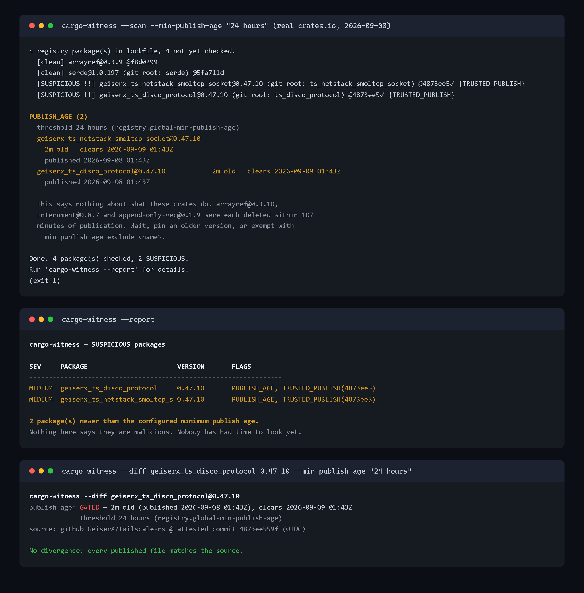

# cargo-witness

**Detect Rust supply-chain attacks by diffing published crate artifacts against their git source.**

`cargo-witness` downloads the exact `.crate` artifact that Cargo installs from
`static.crates.io`, extracts it, and compares it against the **precise git commit
the artifact was published from** — read from the `.cargo_vcs_info.json` embedded
in every modern crate (falling back to git-tag resolution for older ones). The
headline detection is **`BUILD_RS_INJECTED`**:
a `build.rs` file present in the published crate but absent from the git source —
the exact pattern of the *onering* supply-chain attack (June 10, 2026), where a
malicious build script was slipped into the published artifact without ever
appearing in the public repository.

### Detections

| Flag | Meaning |
|------|---------|
| **`BUILD_RS_INJECTED`** | `build.rs` in the published crate, absent from git (the *onering* pattern). |
| **`DEP_INJECTED`** | A dependency declared in the published crate's `Cargo.toml` but absent from the git manifest (the *arrayref* pattern: one added `proc-macro1` line, source untouched). Compared by crate name across every dependency table, with workspace inheritance and renames resolved. |
| **`BUILD_RS_MODIFIED`** | `build.rs` present in both, but the published content differs from the git source (newline-normalised). |
| **`BINARY_NOT_IN_GIT`** | A precompiled `.so/.dll/.exe/.dylib/.wasm` shipped in the artifact but not in source. |
| **`CHECKSUM_MISMATCH`** | The downloaded artifact's sha256 does not match the checksum crates.io recorded — CDN/artifact tampering. |
| **`VERSION_REMOVED`** | crates.io no longer serves this version but the crate exists. Deletion is how crates.io responds to a malicious publish (the *arrayref* incident, Aug 20, 2026). |
| **`CRATE_REMOVED`** | crates.io no longer serves the crate at all (version and crate both 404). |
| `VCS_MISMATCH` (info) | The self-reported publish commit disagrees with the OIDC-attested commit. |
| `TRUSTED_PUBLISH` (info) | Positive signal: published via crates.io Trusted Publishing and verified against the attested commit. |
| **`PUBLISH_AGE`** (opt-in) | The lockfile pins a version younger than `--min-publish-age`. Off unless you pass the flag. Needs no git side, so it fires where the divergence lanes cannot. |
| `YANKED` (info) | The version is yanked on crates.io. |

A `high` or `medium` flag → the package is recorded `SUSPICIOUS` and (interactively)
raises a desktop notification. `info` flags are surfaced but don't mark the
package suspicious.


## The manifest lane (catching arrayref *inside* the attack window)

The August 2026 arrayref compromise added exactly one line to the published
`Cargo.toml`: a dependency on the typosquat `proc-macro1`, whose build script
executes a remote payload. The crate's own source was untouched, so no file
diff fires, and `VERSION_REMOVED` only fires after crates.io deletes the
version, up to 107 minutes later. `DEP_INJECTED` closes that window: the
dependency **names** declared in the artifact's manifest (across
`[dependencies]`, `[build-dependencies]`, `[dev-dependencies]` and every
`[target.<cfg>.*dependencies]` table, resolving `package = "..."` renames to
the real crate name) are compared against the git-side manifest at the same
resolved commit and subdirectory, with `workspace = true` entries resolved
against the repository root's `[workspace.dependencies]`.

Names only, never versions: cargo rewrites the manifest at package time
(inlines workspace inheritance, rewrites path deps, reorders keys), which is
why a byte diff of `Cargo.toml` would flag nearly every crate and is skipped.
Every unknown suppresses the flag rather than guessing: a truncated git tree,
a manifest that fails to parse on either side, an unresolvable workspace
inheritance, or a git-side manifest that turns out to belong to a different
crate (a mis-resolved tag in a multi-crate repo) all suppress instead.
`--diff <name> <version>` explains any suppression and
prints both dependency sets side by side.

The git-side manifest has to be read as content, not as a tree entry, so this
costs one extra blob fetch per crate (cached per repo, ref and path, so
workspace siblings and a shared workspace root reuse one fetch). Set
`GITHUB_TOKEN` when scanning large lockfiles. If the git host rate-limits
mid-scan, the comparison stops for the rest of the run rather than guessing.


## The publish-age gate (declining to go first)

`arrayref@0.3.10` was online for 86 minutes. `internment@0.8.7` for 90.
`append-only-vec@0.1.9` for 107. Every detection above needs both the published
artifact and the git source, which is right for artifact-versus-source
divergence and blind to an attack shape nobody has catalogued yet. A publish-age
gate needs neither. It asks only how old the pinned version is, so any threshold
at all would have sat all three of those compromises out.

It detects nothing. It declines to go first.

```console
$ cargo-witness --scan --min-publish-age "24 hours"
4 registry package(s) in lockfile, 4 not yet checked.
  [clean] arrayref@0.3.9 @f8d0299
  [clean] serde@1.0.197 (git root: serde) @5fa711d
  [SUSPICIOUS !!] geiserx_ts_netstack_smoltcp_socket@0.47.10 (git root: ts_netstack_smoltcp_socket) @4873ee5✓ {TRUSTED_PUBLISH}
  [SUSPICIOUS !!] geiserx_ts_disco_protocol@0.47.10 (git root: ts_disco_protocol) @4873ee5✓ {TRUSTED_PUBLISH}

PUBLISH_AGE (2)
  threshold 24 hours (registry.global-min-publish-age)
  geiserx_ts_netstack_smoltcp_socket@0.47.10
    2m old   clears 2026-09-09 01:43Z
    published 2026-09-08 01:43Z
  geiserx_ts_disco_protocol@0.47.10            2m old   clears 2026-09-09 01:43Z
    published 2026-09-08 01:43Z

  This says nothing about what these crates do. arrayref@0.3.10,
  internment@0.8.7 and append-only-vec@0.1.9 were each deleted within 107
  minutes of publication. Wait, pin an older version, or exempt with
  --min-publish-age-exclude <name>.

Done. 4 package(s) checked, 2 SUSPICIOUS.
Run 'cargo-witness --report' for details.
$ echo $?
1
```

(A real run, 2026-09-08. Both gated crates are published through Trusted
Publishing and verified clean against their attested commit. Nothing is wrong
with them; they are two minutes old, and nobody has had time to look.)

The gate needs no git side at all, which is what makes it different from every
other lane here. Scanning `tatara-kube@0.2.595` the same day: `NO_GIT_TAG` with
the flag absent, because its source could not be resolved and no divergence lane
could say anything about it, and `PUBLISH_AGE` with the flag set.



`--min-publish-age` is **off unless you pass it**, and it is the only thing in
this release that can change an exit code. A gated crate is `medium`, so it
fails the default `--fail-on medium`.

### Cargo has this. It gates the other half.

[RFC 3923](https://rust-lang.github.io/rfcs/3923-cargo-min-publish-age.html) is
stabilized: [rust-lang/cargo#17335](https://github.com/rust-lang/cargo/pull/17335)
merged 2026-08-28 for Rust 1.100, after `-Zmin-publish-age` on nightly from
2026-06-21. What cargo gates is **resolution**. With
`resolver.incompatible-publish-age = "deny"` the resolver "will ignore these
versions unless they already exist in the `Cargo.lock` file", and "once the
versions are recorded in `Cargo.lock`, subsequent resolves will keep them".

So a young version that is already pinned is invisible to the resolver from then
on. So is one forced through with `CARGO_RESOLVER_INCOMPATIBLE_PUBLISH_AGE=allow
cargo update -p foo`, which #17335 says is "preserved within the lockfile". That
committed lockfile is what this gate reads. The two halves compose: cargo stops
young versions getting *into* the lockfile, cargo-witness tells you about the
ones already in it.

Nearest neighbour is [cargo-cooldown](https://github.com/dertin/cargo-cooldown),
a cargo wrapper that resolves the graph and then rewrites fresh versions back to
older compatible ones. Different job, other side of the line: its own README
points CI and release automation at "plain Cargo against committed `Cargo.lock`
files".

### The duration grammar is cargo's

`N seconds|minutes|hours|days|weeks|months`, singular or plural, at most one
space, or `"0"` to disable. Parsed exactly as cargo's `src/util/time_span.rs`
parses it, down to a month being 2,629,746 seconds and `" 1 day"`, `"1 day "`
and `"1  second"` all being rejected. One policy string works in both places.

### Writing the policy where cargo will read it

```console
$ cargo-witness --write-cargo-config --min-publish-age "7 days"
cargo-witness --write-cargo-config -> .cargo\config.toml
  this file does not exist yet; it will be created.
  created: registry.global-min-publish-age = "7 days"
  exemptions: (none)

  Your cargo is 1.95.0. cargo enforces these keys from Rust 1.100
  (stabilized in rust-lang/cargo#17335; nightly -Zmin-publish-age before
  that), so on this toolchain the file is inert until you upgrade.
  Either way cargo only gates RESOLUTION, and its own rule exempts versions
  already recorded in Cargo.lock. Run
    cargo-witness --scan --min-publish-age "7 days"
  to audit the pinned half.
```

The edit is line-based, so every other key, comment, blank line and the file's
EOL style survive it. If the key already has a different value the old one is
printed before it changes; nothing is overwritten in silence. The installed
cargo is read, not assumed, so the note about 1.100 tells you which case you are
actually in. Target another file with `--cargo-config <path>`.

Both spellings cargo accepts are handled: the `[registry]` table, and a
top-level dotted `registry.global-min-publish-age = "..."`. Whichever your file
already uses is the one it keeps. That matters, because TOML forbids mixing
them: appending a `[registry]` table to a file that carries any top-level
`registry.` dotted key makes cargo refuse to load the config at all.

Exemptions are recorded as a `# cargo-witness-exclude = [...]` marker comment
next to the key. RFC 3923 defers a per-package exclude list to future work and
cargo ships no key for one, so writing an invented key would leave you with a
config file cargo complains about. cargo-witness reads its own marker back.

If the file already sets `resolver.incompatible-publish-age = "allow"`, which
turns cargo's resolver gate off entirely, that is printed as a note. It is not
rewritten: which of the two cargo keys you want is your call.

### Edge cases

| Case | Behaviour |
|------|-----------|
| No `created_at` on the version | `unchecked`, reported, **never blocked**. Mirrors, vendored sources and alternate registries legitimately publish no time, and RFC 3923's own applicability section exempts registries that don't set `pubtime`. Failing those closed would break the gate exactly where it is wanted. |
| Age exactly at the threshold | Cleared, not gated. |
| Git and path dependencies | Never reach the gate. They have no registry publish time, and the RFC exempts them for the same reason. |
| The whole crate 404s | Stays `VERSION_REMOVED` / `CRATE_REMOVED`. Not double-reported. |
| Unparseable duration | Exit 2, naming the accepted units. |
| Gated **and** carrying a high/medium flag | One entry saying both, not two findings. That combination is the emergency, and its SARIF result is raised to `error`. |

### Exempting a crate

```bash
# One crate, or one exact version:
cargo-witness --scan --min-publish-age "7 days" \
  --min-publish-age-exclude internal-crate \
  --min-publish-age-exclude hotfix@2.1.0
```

Or through the existing allowlist, which already matches on name and
name+version:

```json
{ "allow": [{ "name": "internal-crate", "flag": "PUBLISH_AGE" }] }
```

The gate deliberately does **not** read `.cargo/config.toml` during a scan.
Reading it would change what an existing user's `--scan` does the moment they
adopt cargo's key, and this release changes nothing unless you ask.

## Why this catches what a `git clone` review misses

Developers audit source on GitHub. But `cargo build` runs the artifact from
crates.io, which is a *separate upload* — an attacker with a publish token can
inject a `build.rs` into the artifact that never touches the repo. `cargo-witness`
compares the thing that actually runs on your machine against the thing you
reviewed.

## Verification anchor (attested → self-reported → tag)

cargo-witness compares against the strongest source anchor available, in order:

1. **Attested commit (Trusted Publishing).** If crates.io recorded a Trusted
   Publishing (OIDC) run for the version, its `trustpub_data.sha` is the commit
   the CI build actually ran from — and the publisher **cannot forge it**. This
   is the gold standard; such crates show `@<sha>✓` and a `TRUSTED_PUBLISH` signal.
2. **Self-reported commit.** Otherwise, the `git.sha1` + `path_in_vcs` embedded in
   the crate's `.cargo_vcs_info.json` — the exact commit the publisher recorded at
   package time (`@<sha>`). If it disagrees with an attested commit, `VCS_MISMATCH`.
3. **Git tag.** For older crates without vcs info, tag formats `v{ver}` / `{ver}` /
   `{name}-{ver}` / `{name}-v{ver}`.

Either way there's no blind tag-guessing when a commit is known, giving
near-complete, precise coverage (e.g. `serde@1.0.197 (git root: serde) @5fa711d`).

## Supported git hosts

**GitHub, GitLab** (incl. self-hosted; paginated tree API) **and
Gitea/Forgejo/Codeberg**. The host is detected from the crate's repository URL.
Set `GITHUB_TOKEN` / `GITLAB_TOKEN` / `GITEA_TOKEN` to raise the respective rate
limits. Repos on unsupported hosts are reported `NO_GIT_TAG` (not a verdict).

## Workspace-aware (no false positives on serde et al.)

Most popular crates live in a **subdirectory** of their repo (cargo workspaces).
`serde@1.0.197`, for example, ships `build.rs` at the crate root, but in git it
lives at `serde/build.rs`. A naïve root-vs-root comparison would flag serde — one
of the most-used crates in existence — as an injection. cargo-witness locates the
crate's true root **inside** the git tree (anchored on the crate's own
`Cargo.toml` location and corroborated by matching source files) before comparing.
This removes the false positive **without** hiding a real injection: an injected
`build.rs` is absent even at the correctly-resolved subdirectory. (See
`test/differ.test.js` — both cases are covered.)

## Install / run

```bash
npm install          # installs deps (better-sqlite3 native build)

# One-time scan of a project's Cargo.lock:
node bin/cargo-witness.js --scan --lock path/to/Cargo.lock

# Nightly daemon (03:00, node-cron); desktop-notifies on any SUSPICIOUS finding:
node bin/cargo-witness.js --daemon --lock path/to/Cargo.lock

# Print all recorded SUSPICIOUS packages as a red table:
node bin/cargo-witness.js --report

# CI mode: scan only packages newly ADDED in the last commit, print JSON,
# exit 1 if any are SUSPICIOUS:
node bin/cargo-witness.js --ci --lock Cargo.lock

# Add a cooldown: flag any pin younger than 7 days (exit 1 if any is):
node bin/cargo-witness.js --scan --min-publish-age "7 days"

# Put cargo's half of that policy in .cargo/config.toml:
node bin/cargo-witness.js --write-cargo-config --min-publish-age "7 days"
```

Once published to npm you can run it with `npx cargo-witness --scan`.

### Options

| Option | Effect |
|--------|--------|
| `--lock <path>` | Path to `Cargo.lock` (default `Cargo.lock`). |
| `--concurrency <n>` | Parallel crate checks (default 5). |
| `--db <path>` | SQLite DB path (default `~/.cargo-witness/witness.db`). |
| `--config <path>` | Allowlist file (default `./.cargo-witness.json`). |
| `--fail-on <level>` | Exit non-zero at/above severity `high\|medium\|info` (default `medium`). |
| `--sarif <path>` | Write a SARIF 2.1.0 report for GitHub code scanning. |
| `--no-recheck` | Skip the 24h registry metadata re-check of already-cleared packages. |
| `--min-publish-age <span>` | Flag lockfile pins younger than `<span>` (RFC 3923 grammar). Off unless passed. |
| `--min-publish-age-exclude <name>` | Exempt a crate from the gate; repeatable, `name` or `name@version`. |
| `--cargo-config <path>` | Target for `--write-cargo-config` (default `.cargo/config.toml`). |
| `--json` | Machine-readable output (`--scan` / `--report`). |
| `--now` | (`--daemon`) run one scan immediately on startup. |
| `--quiet`, `-q` | Suppress per-crate progress lines. |
| `--version`, `-V` | Print version. |

Extra modes: `--history` prints recent scan runs; `--report --json` emits the
suspicious list as JSON; `--diff <name> <version>` shows exactly how a crate's
published artifact differs from its source (unified diff of modified `build.rs` /
source), for triaging a finding; `--write-cargo-config --min-publish-age <span>`
writes the threshold into `.cargo/config.toml` for cargo's own resolver gate.

`--scan` and `--ci` exit non-zero when a finding meets `--fail-on`, so they
double as gates in any pipeline. `--daemon` shuts down cleanly on Ctrl-C / SIGTERM.

### Allowlist (suppressing accepted findings)

Some crates legitimately ship, say, a prebuilt binary. Mute accepted findings
with `.cargo-witness.json` (or `--config <path>`):

```json
{
  "allow": [
    { "name": "ring", "flag": "BINARY_NOT_IN_GIT" },
    { "name": "foo", "version": "1.2.3", "flag": "SOURCE_MODIFIED", "file": "src/gen.rs" }
  ]
}
```

Omitted `version` / `flag` / `file` (or `"*"`) match anything. Suppressed findings
are counted and reported but don't mark the package SUSPICIOUS.

### Environment

| Var | Effect |
|-----|--------|
| `GITHUB_TOKEN` | Raises the GitHub git-trees API limit from 60/hr to 5000/hr. Recommended for scanning large lockfiles. |
| `CARGO_WITNESS_NO_NOTIFY` | Disables desktop notifications (set this in CI/headless). |

Network calls retry with exponential backoff on 429/5xx and honour
`Retry-After` / `x-ratelimit-reset`. Git trees and `build.rs` blobs are cached
per repo tag, so cargo workspace siblings (e.g. `serde` + `serde_derive`) reuse a
single fetch.

State is stored in a SQLite DB at `~/.cargo-witness/witness.db`. Already-checked
`name@version` pairs are skipped on subsequent runs, so daemon scans are cheap.

## Registry removal, and the re-check the store exists for

On Aug 20, 2026 the Rust Security Response Team disclosed a
[supply chain attack on arrayref](https://blog.rust-lang.org/2026/08/20/supply-chain-attack-on-arrayref/):
`arrayref@0.3.10` (86 minutes online), `internment@0.8.7` (90) and
`append-only-vec@0.1.9` (107) were republished depending on the typosquat
`proc-macro1`, whose `build.rs` downloads and executes a payload **at build
time**. crates.io's response was to **delete** the versions. cargo-witness
treats that deletion as the signal it is: a lockfile pinning a withdrawn
version gets a HIGH `VERSION_REMOVED` / `CRATE_REMOVED` finding and a non-zero
exit under the default `--fail-on medium`. And since 1.4.0 the manifest lane
catches the injection itself: the added `proc-macro1` dependency line fires
`DEP_INJECTED` from the artifact-versus-git comparison alone, inside the live
window, with no need for the registry to have reacted yet.

To be accurate about what cargo already does: a **cold** build does fail when a
locked version has vanished from the index, but with a famously unhelpful
error ([rust-lang/cargo#10063](https://github.com/rust-lang/cargo/issues/10063),
open since 2021) that never hints the version was pulled as malicious. On the
machine that matters, the one that ran `cargo update` inside the attack
window, executed the malicious `build.rs`, and still has the `.crate` in
`~/.cargo/registry`, **cargo builds on in silence**; the RSRT's own
remediation advice is a manual find over that cache. And RustSec closed the
arrayref malware report
([rustsec/advisory-db#3161](https://github.com/rustsec/advisory-db/issues/3161))
as not planned, so `cargo-audit` users have no advisory to fire on for this
incident at all. This detection is for that already-fetched, already-executed
case, and for turning a silent exit-0 into a HIGH finding.

Deletion usually happens *after* the malicious version was fetched; the
attack window is minutes to hours. That is what the persistent SQLite store is
for: every scan runs a second, cheap pass over previously-cleared packages
still in the lockfile whose metadata is older than 24h (crates.io metadata
only, no tarball download, no git-tree fetch) and updates their
yanked/removed state. A version withdrawn after cargo-witness cleared it flips
to SUSPICIOUS on the next daemon run instead of staying green forever. Disable
with `--no-recheck`; rate limits during the re-check keep the previous verdict
and retry next run. Alternate (non-crates.io) registry entries are never
probed, and only a genuine 404 counts; outages and 5xx stay errors.

## GitHub Action

`action.yml` runs cargo-witness in CI mode and **fails the build** (exit 1) if a
newly-added dependency is suspicious:

```yaml
- uses: your-org/cargo-witness@v1
  id: witness
  with:
    cargo-lock: Cargo.lock
    github-token: ${{ github.token }}
    fail-on: medium          # high | medium | info
    sarif: cargo-witness.sarif # optional, for code scanning
# Later steps can read outputs:
#   ${{ steps.witness.outputs.suspicious-count }}
#   ${{ steps.witness.outputs.suspicious }}   # JSON array
```

Inputs: `cargo-lock`, `github-token`, `fail-on`, `sarif`, `config`,
`min-publish-age`, `min-publish-age-exclude`. It writes a
**job summary** (a table of any suspicious packages) and sets the
`suspicious-count` / `suspicious` step outputs.

The action entry is bundled to `dist/action.js` with `npm run build:action`
(`@vercel/ncc`). The bundle is **native-free**: the action uses an in-memory
store (its runner is ephemeral), so no platform-specific `better-sqlite3` binary
is committed to `dist/` — it runs on any GitHub runner OS. The CLI/daemon keep the
persistent SQLite store for cross-run history.

A ready-to-copy example is in
[`docs/example-workflow.yml`](docs/example-workflow.yml).

### Runner requirements

The action runs on `node24`, so it needs a runner image that ships Node 24.
Every image GitHub currently supports does, but two cases do not:

- **macOS 13.4 and older, including a `macos-13` runner that has not been
  patched past 13.4.** Node 24 requires macOS >= 13.5, so the runtime will not
  start. `macos-14` and later are fine.
- **ARM32 runners (`linux/arm`, armv7l, 32-bit Raspberry Pi and similar).**
  Node.js publishes no `linux-armv7l` build for 24 at all (20 had one), and
  armv7 was downgraded to Experimental in Node 24, so there is nothing for the
  runner to launch. ARM64 is unaffected.

If you are on one of those, `cargo-witness@v1.5.0` still declares `node20`, but
only until 2026-09-23. After that date GitHub removes the Node 20 runtime from
the runners and v1.5.0 stops launching anywhere.

## Docker

```bash
docker build -t cargo-witness .
docker run --rm -v "$PWD:/work" -w /work cargo-witness --scan --lock Cargo.lock
```

A two-stage build (`Dockerfile`) compiles `better-sqlite3` in a builder stage and
ships a slim final image; default entrypoint runs the daemon.

## Best first distribution step

**Publish to npm as `cargo-witness`** (`npm publish`) so any Rust team can add a
one-line `npx cargo-witness --ci` step to their pipeline — then post the *onering*
detection story (build.rs injected into the artifact but absent from git) to
r/rust and the RustSec / rustsec-advisory community, which is exactly the audience
already primed by that attack.

## How it works (pipeline)

1. **`src/cargo-lock.js`** — parse `Cargo.lock`, keep only `registry+` packages.
2. **`src/store.js`** / **`src/db.js`** — storage interface with two backends: a
   persistent SQLite store (CLI/daemon) and a pure-JS in-memory store (Action/tests).
3. **`src/fetcher.js`** — GET crates.io API v1 for repository + checksum + yanked;
   download the `.crate` from `static.crates.io/crates/{name}/{name}-{ver}.crate`;
   verify sha256; extract; compute each file's git blob SHA.
4. **`src/git-tree.js`** — GitHub git-trees API (path → blob SHA), trying tag
   formats `v{ver}`, `{ver}`, `{name}-{ver}`, `{name}-v{ver}`; raw-blob fetch for
   content confirmation.
5. **`src/differ.js`** — workspace-aware diff (blob-SHA content compare) →
   `CLEAN` / `SUSPICIOUS` / `NO_GIT_TAG` plus flags.
6. **`src/publish-age.js`** / **`src/cargo-config.js`** — RFC 3923 duration parsing,
   the age gate, and the `.cargo/config.toml` reader/writer.
7. **`src/severity.js`** / **`src/allowlist.js`** — severity model + suppression.
8. **`src/scanner.js`** / **`src/notifier.js`** — orchestrate, record, desktop-notify.
9. **`src/report.js`** / **`src/sarif.js`** — severity table / JSON / SARIF output.
10. **`bin/cargo-witness.js`** — CLI; **`src/action.js`** — GitHub Action entry.

## Implementation notes (verified against live services)

- The crates.io **version** endpoint (`/api/v1/crates/{n}/{v}`) returns only
  `{ version: {...} }` — there is **no** top-level `crate` object; the repository
  URL is at `version.repository`.
- The API's `dl_path` (`/api/v1/crates/{n}/{v}/download`) is a crates.io redirect
  path, **not** a static.crates.io path — prefixing it onto `static.crates.io`
  returns **403**. cargo-witness downloads from the direct CDN pattern instead.
- `action.yml` uses `using: node24`. GitHub removes Node 20 from the runners on
  **2026-09-23**, and an action declaring `node20` will not launch after that.
  The runner cannot find the interpreter, so the step fails before any of this
  code runs. `test/action-runtime.test.js` fails if `runs.using` names a runtime
  that is gone or within 180 days of going, so the next move is a red test
  rather than a broken workflow.
- `npm run validate:action` still runs `@action-validator/cli`, but no longer
  lets it veto the runtime. Its schema was last published on 2024-02-23 and is
  compiled into a wasm blob, so its `runs.using` enum stops at `node20` and
  cannot be pointed at a newer copy. The wrapper re-validates the file with the
  runtime swapped for one the schema accepts: if that clears every error, the
  runtime string was the only objection and the rest of the file is valid.
  Anything else the validator reports still fails.
- Content comparison uses the **git blob SHA** returned by the trees API
  (`sha1("blob "+len+"\0"+content)`), so every shared file is content-checked with
  **no extra network calls**; only a SHA mismatch triggers a raw fetch, which is
  then confirmed against newline-normalised content to avoid CRLF false positives.
- Bundling a native module into a GitHub Action would commit a platform-specific
  binary that breaks on other runner OSes; the action therefore uses the in-memory
  store and its bundle is native-free.

## Tests

```bash
npm test        # 9 suites, 165 assertions
```

- `action-runtime.test.js` — `action.yml` declares a runtime GitHub still runs,
  and the scoped `validate:action` gate still fails on any other schema error.
- `differ.test.js` — blob-SHA diff, workspace false-positive fix, real-attack
  detection, truncated-tree handling, content-suspect detection.
- `publish-age.test.js` — the RFC 3923 duration grammar against cargo's own
  accept/reject vectors, threshold evaluation (boundary, missing `created_at`,
  recomputation from the absolute timestamp), the `.cargo/config.toml` round
  trip (comments, blank lines, CRLF, idempotency), and an offline end-to-end run
  covering a fresh pin, a boundary pin, a pin with no publish time, git and path
  deps, **a crate whose git side cannot be resolved** (the regression that proves
  the gate is independent of the diff lanes), the combined high-flag case,
  exemptions, `--json`, SARIF levels and every CLI exit code.
- `manifest.test.js` — dependency-name extraction (all tables, renames,
  workspace inheritance), the injected-dependency case, and every conservative
  suppression (truncated tree, unparseable manifest, unresolvable inheritance).
- `cargo-lock.test.js` — lockfile parser (registry vs git/local, CRLF, alt registries).
- `ci-diff.test.js` — CI added-package diff parsing.
- `units.test.js` — severity model, allowlist suppression, SARIF shape, diff algorithm.
- `hosts.test.js` — GitHub / GitLab (paginated) / Gitea-Codeberg providers, rate-limit handling.
- `integration.test.js` — **fully offline** end-to-end: a local mock server serves
  crates.io / static CDN / GitHub (with real blob SHAs), real `.crate` tarballs are
  built on the fly, and every detection (`BUILD_RS_INJECTED`, `BUILD_RS_MODIFIED`,
  `DEP_INJECTED`, `SOURCE_MODIFIED`, `FILE_NOT_IN_GIT`, `BINARY_NOT_IN_GIT`,
  `CHECKSUM_MISMATCH`, `YANKED`, `TRUSTED_PUBLISH`, `VCS_MISMATCH`, exact-commit
  + `path_in_vcs` resolution, workspace resolution, allowlist) is asserted.
